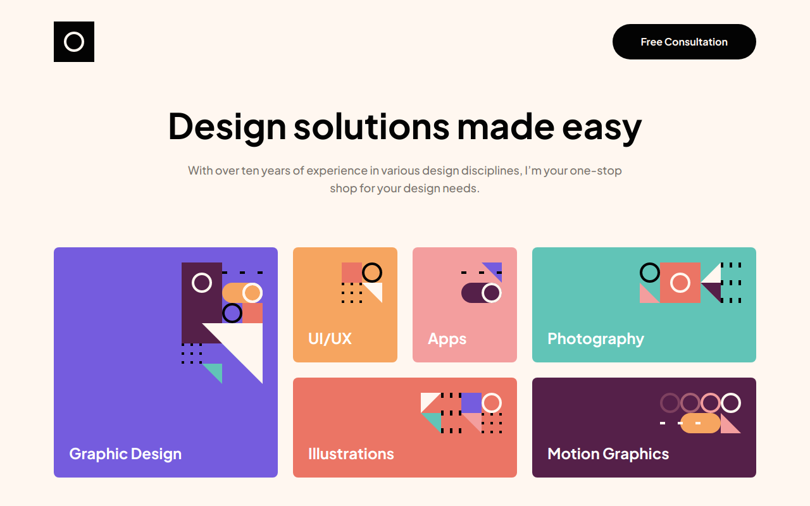

# Frontend Mentor - Single-page design portfolio solution

This is a solution to the [Single-page design portfolio challenge on Frontend Mentor](https://www.frontendmentor.io/challenges/singlepage-design-portfolio-2MMhyhfKVo). Frontend Mentor challenges help you improve your coding skills by building realistic projects.

## Table of contents

- [Frontend Mentor - Single-page design portfolio solution](#frontend-mentor---single-page-design-portfolio-solution)
  - [Table of contents](#table-of-contents)
  - [Overview](#overview)
    - [The challenge](#the-challenge)
    - [Screenshot](#screenshot)
    - [Links](#links)
  - [My process](#my-process)
    - [Built with](#built-with)
    - [What I learned](#what-i-learned)
    - [Continued development](#continued-development)
    - [Useful resources](#useful-resources)
  - [Author](#author)

## Overview

### The challenge

Users should be able to:

- View the optimal layout for the site depending on their device's screen size
- See hover states for all interactive elements on the page
- Navigate the slider using either their mouse/trackpad or keyboard

### Screenshot



### Links

- Solution: [URL](https://www.frontendmentor.io/solutions/singlepage-design-portfolio-with-react-and-scss-tW9DSezVN6)
- Live Site: [URL](https://single-page-design-portfolio-drab.vercel.app/)

## My process

### Built with

- Semantic HTML5 markup
- CSS custom properties
- Flexbox
- CSS Grid
- Mobile-first workflow
- [React](https://reactjs.org/) - JS library

### What I learned

I learned to do a Slider with React. I used the useState hook to modify the styling and give it the desired functionality.

```js
function Slider() {
  var [slide, setSlide] = useState(2);

  return (
    <div className="slider">
      <div className="slider__viewport">
        <div
          className="slider__main"
          style={{ left: `calc(-${slide} * 100%)` }}
        >
          {images.map(function createImageElements(img, index) {
            return ;
          })}
        </div>
      </div>
      <div className="slider__controls">
        <button
          className="slider__btn arrow"
          aria-label="click for the previous image"
          onClick={function moveSlideLeft() {
            if (slide > 0) {
              setSlide(slide - 1);
            }
          }}
        >
          
        </button>
        <button
          className="slider__btn arrow"
          aria-label="click for the next image"
          onClick={function moveSlideLeft() {
            if (slide < images.length - 1) {
              setSlide(slide + 1);
            }
          }}
        >
          
        </button>
      </div>
    </div>
  );
}
```

### Continued development

I want to learn more about React hooks and styling in general.

### Useful resources

- [CSS-Only Carousel](https://css-tricks.com/css-only-carousel/) - Although I didn't do the carousel like these ones, it helped me to see what is possible and made me think of different ways to achieve similar effects.

## Author

- Frontend Mentor - [@miguelzaga](https://www.frontendmentor.io/profile/miguelzaga)
